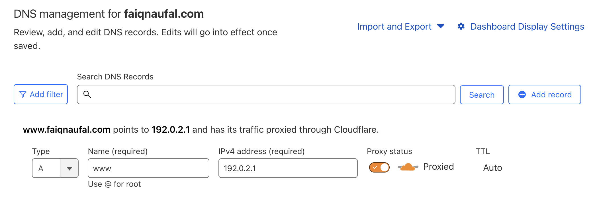
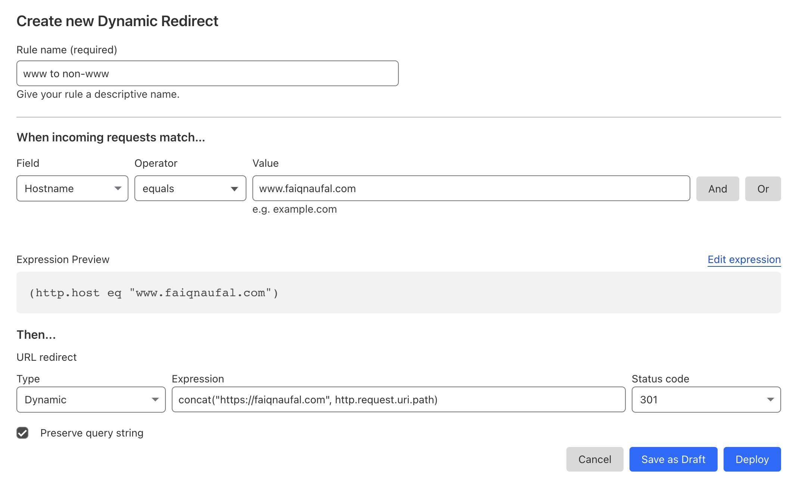
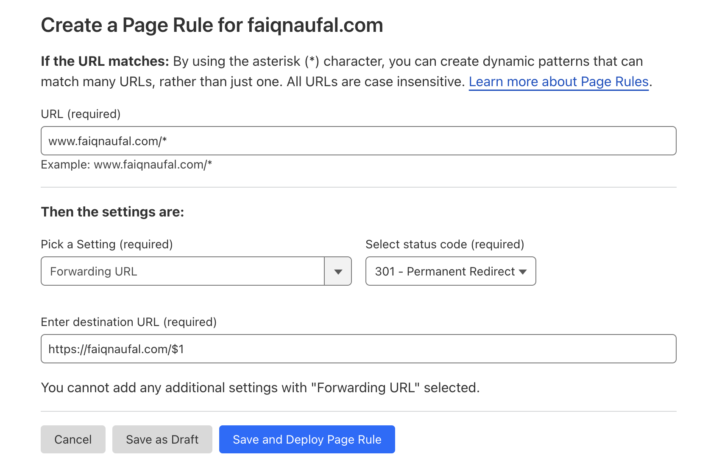

I always believe there is no right or wrong decision in terms of choosing a www or non-www  domain. In the past, I decided to chose the non-www version for this website simply because it made the address shorter. However, I realized when I typed my website with additional www version, the website became unreachable and I didn’t want to make my visitors experienced the same thing.

The common way and the one I did to solve this was to redirect the visitor that visits my website with the www version to the non-www version with domain-level redirection feature with services like Cloudflare. This is especially helpful if we host the website in an environment where we don’t have full access to the web server. For example, when we host the website in Netlify, Vercel, or Cloudflare Pages.

## Configure the DNS

Every redirection configuration in Cloudflare requires us to add the DNS through Cloudflare. I said earlier when the visitors visited the www version of my website, the visitors got unreachable URL. That was because the DNS for the www version not added and configured properly from the DNS records. If we wanted to redirect from www version to non-www version, we needed to add the www subdomain to the DNS records.

DNS records menu in Cloudflare can be found after selected one of the registered domain. We need to add the www subdomain to the DNS record. There are several rules that need to be followed:

1. The subdomain name will be `www` because we need to add the DNS record for this subdomain.
2. The type of record must be either be an `A` record with IP address value of `192.0.2.1` or an `AAAA` record with IP address value of `100::`.
3. We also need to have a [Cloudflare proxy status](https://developers.cloudflare.com/dns/manage-dns-records/reference/proxied-dns-records) enabled so any incoming traffic to the website will be proxied through Cloudflare.

After the DNS records for www subdomain is added, we’re ready to set a rule that redirects any requests from www to non-www domain.

## Method 1: Set redirect rule with single redirects

This is the method that I’m currently using. The single redirects is a feature from Cloudflare that allow us to create a static and dynamic URL redirects. It offers more flexibility built specifically for URL redirects purpose. We can find the single redirects menu in the Cloudflare domain menu. The menu is called redirect rules. If you use a free plan, you can create up to 10 single redirects rules.

There are static and dynamic URL redirects, and the one we will use is the dynamic URL type. Why we use dynamic URL type? This is because with static URL redirect type, you can only input a static URL redirect. We want to create a dynamic URL redirect rule that uses expression from Cloudflare. For example, with `concat()` function we can get the current path of the incoming request URL and then concat it to the destination URL.

To create a new dynamic redirect rule that redirects from www to non-www domain, you can create a configuration that looks like this.

In the configuration above, the rule will do a checking for any incoming request hostname. If the hostname equals to `www.faiqnaufal.com`, then we will do a URL redirect with the `dynamic` type to https://faiqnaufal.com and concat it with the current URI path of the incoming request.

I set the status code to `301` redirect because I expect the source URL (www version) is always to be used to redirect visitors and give indication that visitors should not visit that URL to view the page. I also set the "Preserve query string" option to preserve any query string from the incoming request.

If you have configured the DNS and rule correctly, any incoming request will be redirected to the non-www version. If you want to configure non-www to www version, just replace the value with your preferred one.

## Method 2: Set redirect rule with page rule

This is the old method that I had been using until recently. We define a page rule to trigger one or more actions whenever a certain URL pattern is matched. If you use a free plan, you can create up to 3 page rules. We can find the page rule menu in the Cloudflare dashboard after selected one of the registered domain.

To create a page rule that redirects from www to non-www domain. The configuration looks like this.

The above configuration will create a page rule that will redirect every page request under www.faiqnaufal.com domain to https://faiqnaufal.com and set the 301 permanent redirect status code.

The `$1` refer to the first wildcard `*` we define in the source URL and will append the path from the source URL to the destination URL. For example, if the visitor goes to www.faiqnaufal.com/about then the destination URL will be redirected to  https://faiqnaufal.com/about.

If you have configured the DNS and rule correctly, any incoming request will be redirected to the non-www version. If you want to configure non-www to www version, just replace the value with your preferred one.

For more references, see below links:
- https://developers.cloudflare.com/support/page-rules/configuring-url-forwarding-or-redirects-with-page-rules/
- https://developers.cloudflare.com/support/page-rules/understanding-and-configuring-cloudflare-page-rules-page-rules-tutorial/
- https://developers.cloudflare.com/rules/url-forwarding/single-redirects/
- https://developers.cloudflare.com/ruleset-engine/rules-language/functions/
