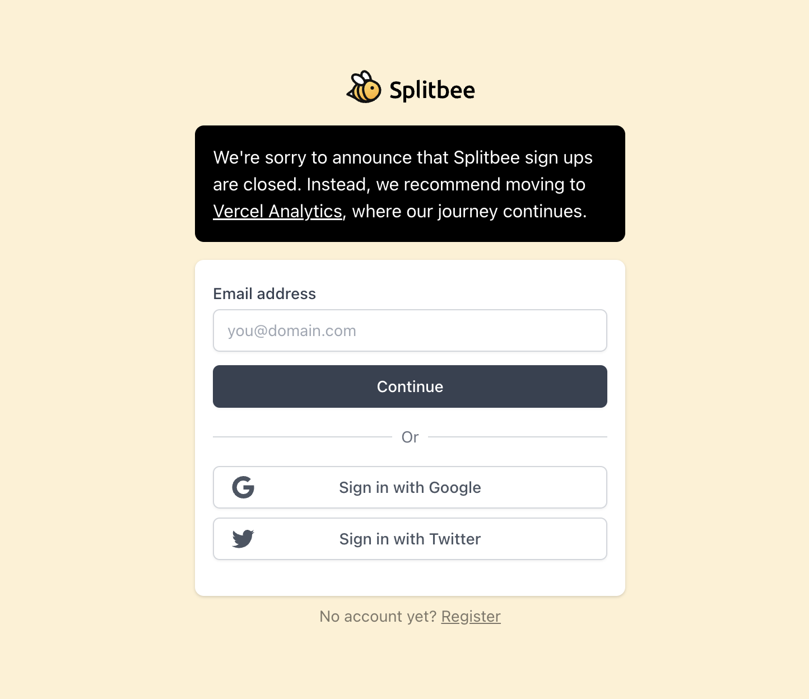
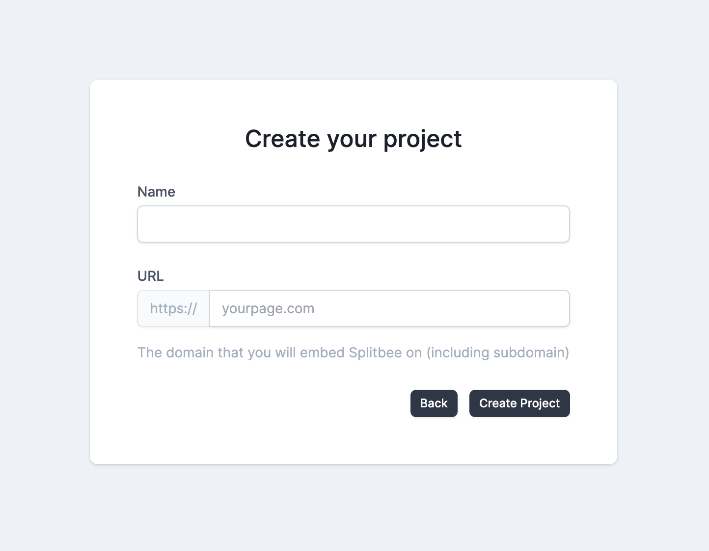
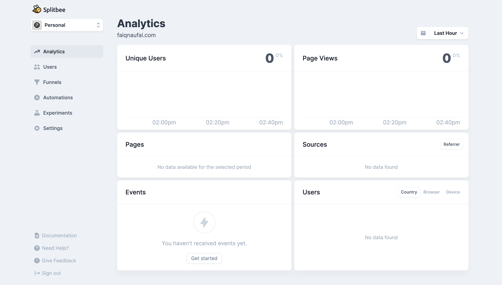

## The need for Google Analytics alternative

When we talk about analytics services, the one choice that most people know is Google Analytics. Google Analytics is a free and powerful analytics service integrated with Google services which gives you the tools you needed. However, I encourage you to avoid using it as it collects a lot of personal data, [violates the European GDPR privacy law](https://noyb.eu/en/austrian-dsb-eu-us-data-transfers-google-analytics-illegal), and is considered illegal in several countries. If you want to collect analytics data without worrying about breaking the law, you can consider [Splitbee](https://splitbee.io/) as an alternative analytics tool.

## Why Splitbee?

[Splitbee](https://splitbee.io/) is a friendly analytics and conversion tool that helps you monitor visitor traffic in real time. It provides great tools for building conversion funnel, managing custom events, experimenting with redirect and A/B testing, and running automated tasks on some services. It only collects basic visitor traffic data, built with privacy in mind, and GDPR compliant. The service is not completely free, but Splitbee provides a generous free plan which is perfect for small SaaS businesses, personal websites, or just for experimenting before deciding to use the service.

Want to know about cool things about Splitbee?

- Simple and easy-to-understand onboarding experience.
- Clean, fast, and user-friendly analytics dashboard which updates in real-time.
- The library is small and easy to implement.
- Public analytics dashboard mode to share the analytics insight with everyone.

In my opinion, Splitbee is analytics that can get you running quickly without the need to learn many things.

## But, isn’t Splitbee already acquired by Vercel?

Yes, [Vercel has acquired Splitbee](https://vercel.com/blog/vercel-acquires-splitbee) since October 2022 to expand their Vercel web analytics product. If your website is already deployed in Vercel, and intend to use their analytics feature you should follow the docs for [Vercel Web Analytics](https://vercel.com/docs/concepts/analytics) instead. However, if you are not a Vercel customer and intend to use Splitbee, you can register an account in the original Splitbee analytics dashboard. We will talk about this in the next section.

## Astro setup

We will use [Astro framework](https://astro.build/) and add the Splitbee analytics script to it. Astro is the all-in-one web framework that supports integration with many JavaScript UI libraries. It doesn’t require you to lock into one JavaScript library ecosystem such as React, Vue, or Svelte. So it’s up to you to implement your website with your library choice.

Let’s start by creating a new Astro project using the CLI command. This will create a project with the basic template.

```bash
npm create astro@latest
```

## Partytown setup

We will use library called Partytown. Partytown is a library to helps relocate and offloading the script resources into a web worker, which make the script run in background thread. Usually, you should use this for script or third-party scripts that can block the main thread. By removing the blocking script, you can improve the performance of your site. Because we will use the third-party analytics script from Splitbee, we don’t want the script to make our website heavy or blocking the main thread. Therefore, we can just move the Splitbee analytics script into the web worker, so it will run in the background thread.

Astro has partytown integration already. That makes it easy for us to implement. Let’s setup the partytown manually.

Install the required dependencies

```bash
npm install @astrojs/partytown
```

In your astro project, open the `astro.config.*` file and import the dependency we have installed

```jsx
import { defineConfig } from 'astro/config';
import partytown from '@astrojs/partytown';

export default defineConfig({
  // ...
  integrations: [partytown()],
});
```

Congratulations, you have successfully set up the Partytown and Astro project. We will finally start integrating Splitbee analytics into our website.

## Create a Splitbee account

Splitbee already closed the manual registration form input because of Vercel acquisition. Fortunately, you can still create an account by using a social sign-in option such as Google or Twitter. You can visit this page [https://splitbee.io/login](https://splitbee.io/login) and choose either Google or Twitter sign-in options. Don’t worry, the service is still working properly.



## Add your website domain

After you have signed in, you will be asked to create your first Splitbee project. Give your project a name and the URL of your website. The Splitbee analytics script will monitor the traffic on the URL you provide here. After this, your project will be created and you will be redirected to your Splitbee dashboard.



Your dashboard will look like this and is currently still empty. Let’s add the Splitbee analytics script to monitor your website traffic.



## Add Splitbee analytics script to your project

To add the Splitbee analytics script, you need to add the following script tag to your astro file in the pages directory. You can disable the Splitbee cookie by adding the data-no-cookie attribute to the script tag. You can also make the analytics respect the do not track setting of the browser by adding the data-respect-dnt attribute to the script tag.

```html
<script async src="https://cdn.splitbee.io/sb.js" data-respect-dnt data-no-cookie></script>
```

Alternatively, if you want to use NPM version, you can use the [@splitbee/web](https://splitbee.io/docs/javascript-library) package and install it using the NPM CLI command. In our case, we will stick to using the script tag.

```bash
npm install @splitbee/web
```

That’s it. Actually until this step you are already ready to monitor your website traffic using the analytics script. However, the current script is running in the main thread. To make the script run in the background thread we will relocate the script to the web worker using Partytown.

## Relocate the script to the background thread using Partytown

To relocate the script to the web worker using party town is easy. All you need to do is give the script type `text/partytown` value. We don’t need the `async` attribute anymore because this script will be run in the background thread.

```html
<script
  type="text/partytown"
  src="https://cdn.splitbee.io/sb.js"
  data-respect-dnt
  data-no-cookie
></script>
```

Until this step, you have successfully finished the Splitbee integration with Astro framework and Partytown. After this, you need to deploy your code and whenever there is a new traffic to your website URL, Splitbee will monitor that traffic and display the data into the Splitbee dashboard.

## Further step

You can take the analytics implementation further by creating funnel analytics, creating event tracking on your website, running automated tasks for a specific event, and other things Splitbee supported.
